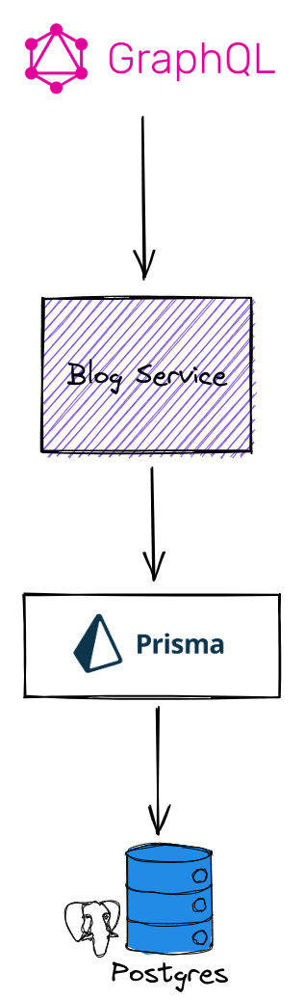
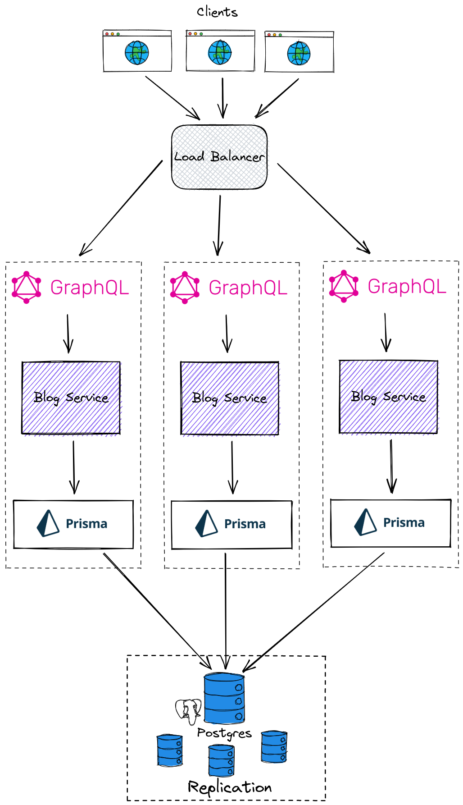
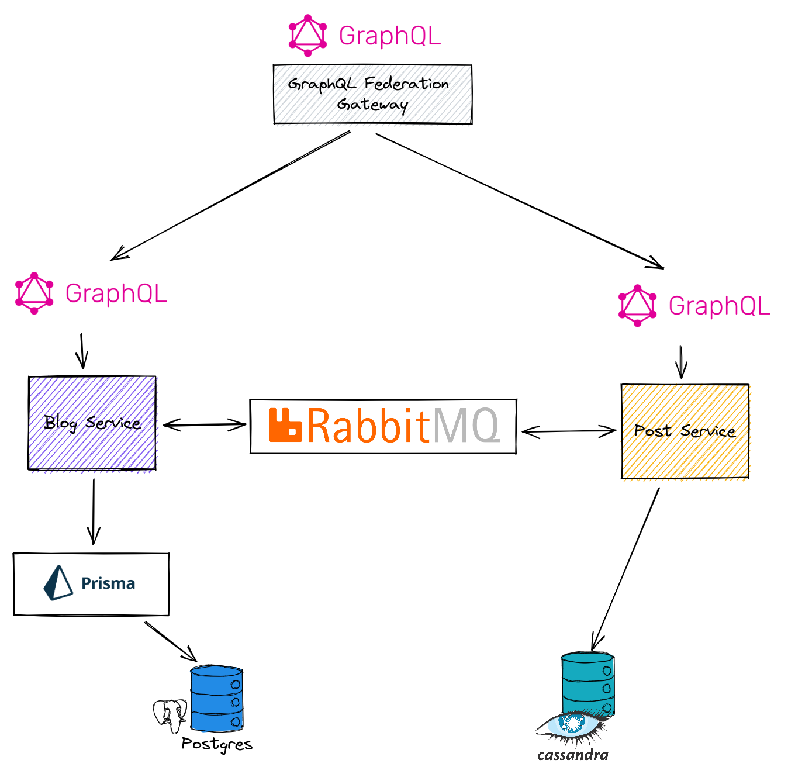

# Blog Service

⭐ An example project for creating a blog microservice.

## Description

[Nest][nest] framework TypeScript starter repository.

## Installation

```bash
$ yarn install
```

## Running the app

You can either use docker to start the service and query `http://localhost:8080/graphql`

```bash
docker-compose up
```

You can also start it by copying `.env.template` as `.env` and fill the variables then running one of the commands:

```bash
# development
$ yarn start

# watch mode
$ yarn start:dev

# production mode
$ yarn start:prod
```

## Test

```bash
# unit tests
$ npm run test

# e2e tests
$ npm run test:e2e

# test coverage
$ npm run test:cov
```

## Example Graphql queries and mutations

```graphql
### Blogs ###

mutation createBlog {
  createBlog(createBlogInput: { name: "blog-test", slug: "blog-test-slug" }) {
    id
    name
    slug
    posts {
      id
      title
    }
  }
}

mutation createBlogWithPosts {
  createBlog(
    createBlogInput: {
      name: "blog5"
      slug: "blog5"
      posts: [{ content: "post1" }, { content: "post2" }]
    }
  ) {
    id
    name
    slug
    posts {
      id
      title
      content
    }
  }
}

query findAllBlogs {
  blogs {
    id
    name
    slug
    posts {
      id
      title
      content
      viewCount
    }
  }
}

query findBlogById {
  blogById(id: 2) {
    id
    name
    slug
  }
}

query findBlogBySlug {
  blogBySlug(slug: "blog1") {
    id
    name
    slug
  }
}

query findAllFilterBlogs {
  blogs(search: "blo") {
    id
    name
    slug
    posts {
      id
      title
    }
  }
}

mutation deleteBlog {
  removeBlog(id: 1) {
    id
    name
    slug
    posts {
      id
      title
    }
  }
}

### Posts ###

query findAllPosts {
  posts {
    id
    title
    content
    viewCount
    blog {
      id
      name
    }
  }
}

query findAllFilterPosts {
  posts(search: "c") {
    id
    title
    content
    blog {
      id
      name
    }
  }
}

mutation createPost {
  createPost(
    createPostInput: { title: "post2", content: "post2 content" }
    blogId: 2
  ) {
    id
    title
    content
    viewCount
    blog {
      id
      name
    }
  }
}

mutation increaseViewCount {
  incrementPostViewCount(id: 3) {
    id
    title
    viewCount
  }
}
```

## Notes

> What were some of the reasons you chose the technology stack that you did?



- GraphQL:

  - No over-fetching and under-fetching problems.
  - Make client define the needed data shape i.e. optionally return related Posts or not.
  - Went with code-first to minimize code redundancy, better code reuse, and type safety.

- NestJS:

  - Make it easy to split the microservice into even more smaller microservices if needed in the future.
  - Easy to use, well active, and maintained framework with big community and support.
  - Uses a great architectural patterns which make the service scalable, testable, and loosely coupled.
  - Handle query complexity

- Prisma:

  - [increase productivity](https://www.prisma.io/docs/concepts/overview/why-prisma#tldr)

- Postgres:

  - Enforce data accuracy.
  - Data integrity

- Docker:
  - Easy start and deploy the service.
  - Better developer experience.

> What were some of the tradeoffs you made when building this application? Why were these acceptable tradeoffs?

- GraphQL instead of REST
- Using NestJS instead of Next.js
- Using an ORM (Prisma)
- Went with a RDBMS (Postgres) and not NoSql (Mongo).

> Given more time, what improvements or optimizations would you want to add later?

- More test coverage
- Better pagination with cursor-based pagination and `PageInfo` meta.
- Add `createdAt`, `updatedAt` fields to Blogs and Posts.
- Better error handling

> What would you need to do to make this application scale to hundreds of thousands of users?



> How would you change the architecture to allow that models are stored in different databases? E.g. posts are stored in Cassandra and blogs are stored in Postgres.


